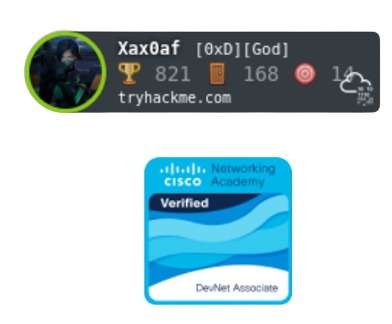

  

<h3 align="center">👩🏼‍💻 Youmna Jaza | 💻 Software Engineering Student | 🏫 Al Yamamah University</h3>

<a href="https://tryhackme.com/p/Xax0af">
<a href="https://discord.com/users/717377313049804911">
<a href="https://twitter.com/Ybx_n">
<a href="https://www.linkedin.com/in/youmna-jaza-373016233/">

## About me:

-  CTF Player  
-  IEEE member
-  I spend my free time solving challenges on [TryHackMe](https://tryhackme.com/) and [Codewars](https://www.codewars.com/)
-  Always looking forward to learn more
 
## Languages and Tools:

## Learning: 

## Achievements & Certifications

 
🏆 [2021] Dean’s Honor List, Al Yamamah University.   
🏆 [2021] Top 10 in CyberHub CTF by SAFCSP for all KSA students.    
🏆 [2021] Top 10 in KSA TryHackMe.   
🏆 [2021] DevNet Associate, Cisco Networking Academy.   
🏆 [2021] NDG Linux Essentials, Cisco Networking Academy.  
🏆 [2021] Vulnerability Management, Qualys.    
🏆 [2020] Programming Essentials in Python, Cisco Networking Academy.  
🏆 [2020] Entry Level Course on Cybersecurity, Kaspersky.   
🏆 [2020] Cybersecurity Foundation, Palo Alto Networks Academy.  
🏆 [2020] Database Foundations, Oracle.  
🏆 [2019] Introduction to cybersecurity, Cisco Networking Academy.  

***  

	

